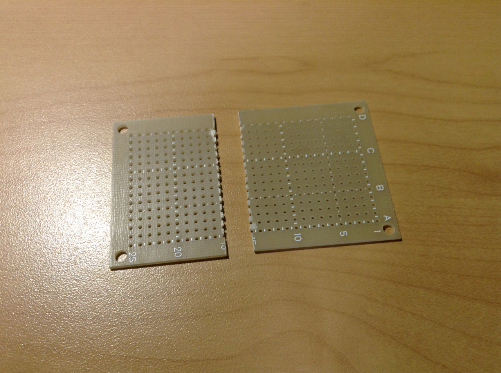
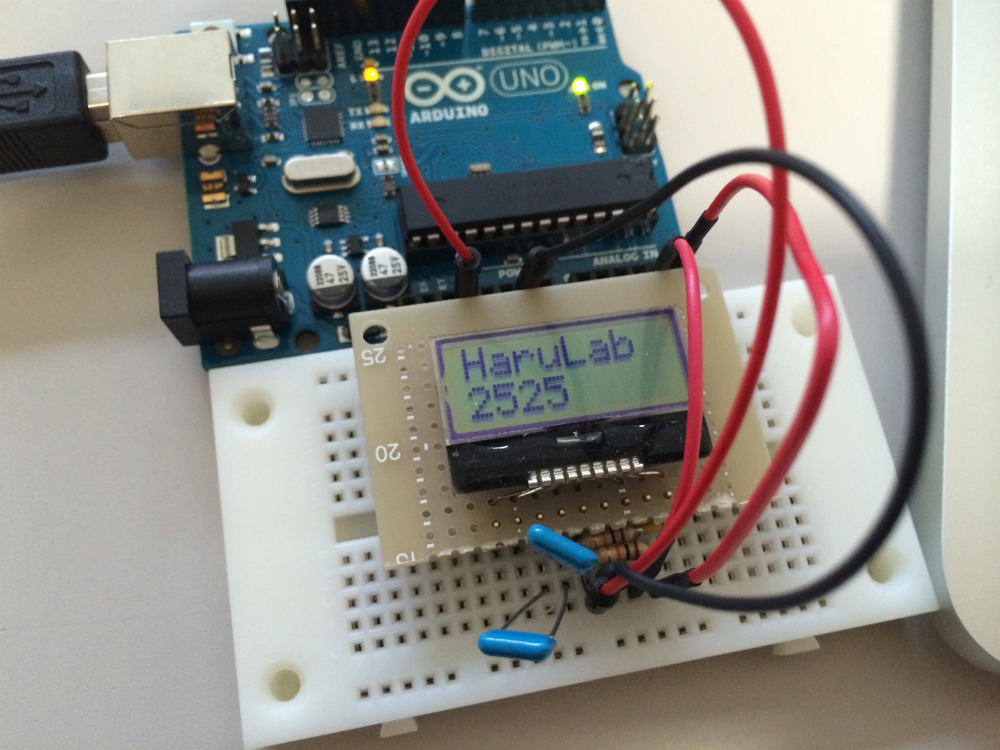
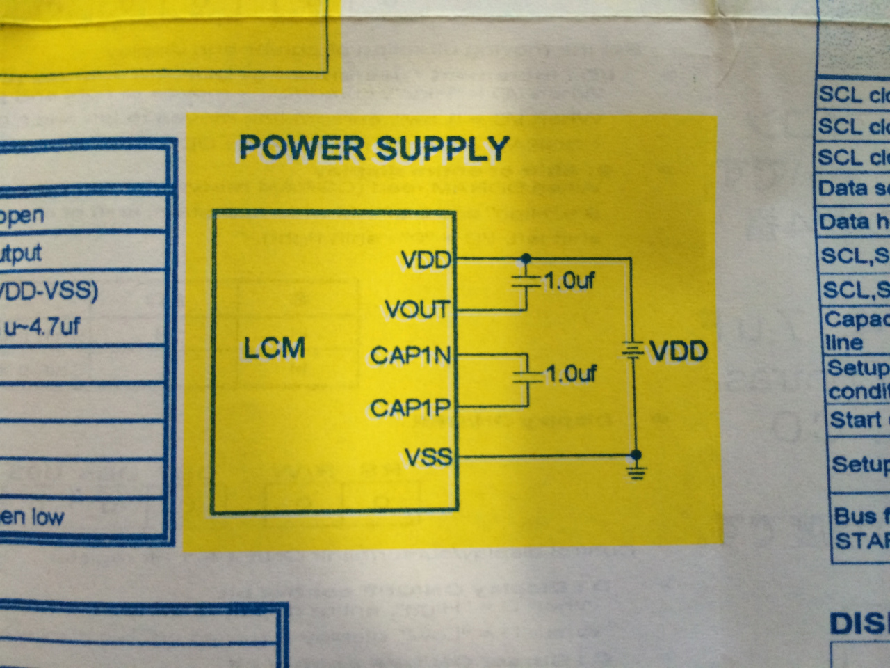

学校の実験で使うため秋月で手軽なLCDを購入することに。

そこで見つけたのがこちら


[AQM0802A-RN-GBW](http://akizukidenshi.com/catalog/g/gP-06669/)

I2C通信を使った8*2の手軽なLCDです。
なんといってもお値段が320円というのが魅力。

今回はこれをArduinoを使って動作させてみようと思います。
あとこれを使うにあたって、つまずいたところもあったので簡単にまとめておきます。

## 1. 準備物

制御に用いるArduino

<a target="_blank" href="https://www.amazon.co.jp/gp/product/B008GRTSV6/ref=as_li_tl?ie=UTF8&camp=247&creative=1211&creativeASIN=B008GRTSV6&linkCode=as2&tag=haruyuki04-22&linkId=826cb16dad367b86f5e2b4c8dfc912b9">Arduino Uno Rev3 ATmega328 マイコンボード A000066</a>

加えて、このモジュールを使用するために必要な電子部品

* 10kΩ 抵抗*2
* 1μF コンデンサ*2

必要物はこれだけですが、AQM0802Aには付属していないので用意する必要があります。

## 2. ピッチ変換 (ブレッドボードで使う方のみ)

ブレッドボード上でテストしようと思ったのもつかの間、このモジュールのピッチは1.5mmとブレッドボードのピッチ幅よりも小さいので以下のリンクのようなピッチ変換済のもの、またはピッチ変換基板を用意してあげると便利です。

* http://akizukidenshi.com/catalog/g/gK-06795/
* http://akizukidenshi.com/catalog/g/gP-06794/


図のように頑張って足を広げてもブレボにはまらなかったため



ユニバーサル基板をカットして


こんな感じに的当にハンダ付けしました。

## 3. Arduinoとの接続

接続表を作ってみましたので、それを見てください


## 4. プログラムの書き込み

このLCDはI2C通信を使っているため通常のLCDライブラリでは動作しません。

AQM0802Aが簡単に使えるライブラリが制作、公開されていましたのでこちらを使わせてもらうことにしました。(ありがとうございます!!)

http://ore-kb.net/archives/195

ライブラリの導入についてはリンク先サイトでも書かれていますが、
zipファイルを解凍して出てきたフォルダ「arduino_ST7032-master」を「ST7032」にリネームし、arduinoの「libraries」フォルダにコピーするだけ。

自分の場合はmac環境なので書類→Arduino→libraryの中にコピーすれはおk

ただ上のリンク先の簡単な使い方ではなぜか動作せず、lcdのbigin関数を入れてやれば問題なく動きました。

ソースは以下もので動くはずです。

```c
#include <Wire.h>
#include <ST7032.h>

ST7032 lcd;

void setup(){
    lcd.begin(8, 2);
    lcd.setContrast(30);
    lcd.print("HaruLab");
}

void loop(){
    lcd.setCursor(0, 1);
    lcd.print("2525");
}
```

あとはこれをArduinoに書き込んであげれば終了。



うまく行けばこのように動作するはず。

## おまけ. 引っかかった問題点

今回初めてI2C通信のLCDを使い、リファレンスもあまり読まないままに的当にテストしていました。抵抗だけ用意してArduinoとLCDをつなげていたため当然動作するはずもなくハンダ付けの際にIC焼いちゃったかな? 位で考えてました(笑)

ただ、ふと研究室でAQM0802Aのデータシートを見た時...



明らかに電源供給でコンデンサを使っているがわかりますよねw

手を動かす前にデータシートはちゃんと見るべきですね。

反省ですw

## Reference

* <a target="_blank" href="https://www.amazon.co.jp/gp/product/B008GRTSV6/ref=as_li_tl?ie=UTF8&camp=247&creative=1211&creativeASIN=B008GRTSV6&linkCode=as2&tag=haruyuki04-22&linkId=826cb16dad367b86f5e2b4c8dfc912b9">Arduino Uno Rev3 ATmega328 マイコンボード A000066</a>
