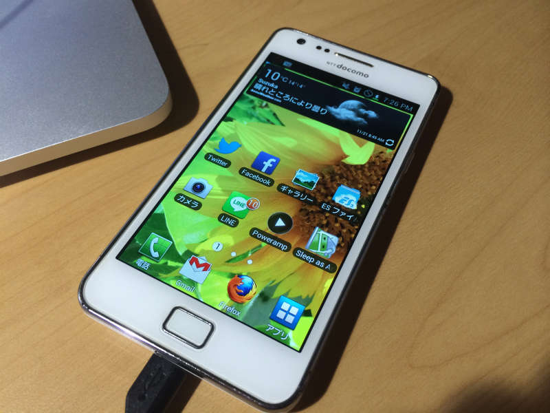

最近Androidでしか使えないアプリと発見したため、急遽机の中からGalaxy S2(SC-02)を引っ張り出してきました。



しかしiPhoneに乗り換えてから長い間使っていなかったためOSとかもえらく古い感じ。 せっかくのAndroid! この機会に2014.09.18時点では最新の Android 4.4 KitKat を入れてみることにしました。

うまくいかなかった部分もあったので導入の手順をまとめておこうと思います。

## 1. 下準備

まずインストールするカスタムROMを選択します。
カスタムROMにもいくつか種類がありますが有名所の

* CyanogenMod
  * (Nightly→Snapshot→Stableの順でカスタムROMの安定度が増します)
  * http://download.cyanogenmod.org/?device=i9100
* slimKat
  * http://slimroms.net/index.php/downloads/dlsearch/viewcategory/1058-i9100

あたりでいいのではないかと思います。 どちらもいい感じですがslimkatは比較的シンプルで扱い易いといった印象。

今回は個人的に好みなslimKatを選びました。
上のリンクから2014.09.18現在で最新版のをダウンロード。

<http://slimroms.net/index.php/downloads/dlsearch/viewdownload/1058-i9100/10774-slim-i9100-4-4-2-build-5-official-4068>

カスタムROMだけではGoogle Playなどの重要なアプリが入っていないためアプリのまとめたれたもの(GAPPS)を以下からダウンロードします。

<http://slimroms.net/index.php/downloads/dlsearch/viewcategory/1150-addons4-4>

状況に応じてmini、normal、fullの中から選んでください。
今回はあまりアプリはいらないので以下のmini版を選択。

<http://slimroms.net/index.php/downloads/dlsearch/viewdownload/1150-addons4-4/13394-slim-mini-gapps-4-4-4-build-7-x-187>

またルート化したい場合は以下からSuperSUをダウンロード。

<http://download.chainfire.eu/372/SuperSU/UPDATE-SuperSU-v1.86.zip>

これらのzipファイルをmicroSDのルードでもフォルダ内でも適当な場所にコピーします。 あとはmicroSDをGalaxy S2の中に入れておいてください。

これで下準備は完了です。

## 2. CWMの書き込み

カスタムROMをインストールするためにはCWM(ClockworkMod)と呼ばれるリカバリーソフトを導入する必要があります。雰囲気でいうならPCのBIOSみたいなものです。

書き込むためのソフトはOdinを公式からダウンロード。

<http://odindownload.com>

またCWMはいろいろありますが以下のものを利用。

http://forum.xda-developers.com/galaxy-s2/orig-development/kernel-clockworkmod-recovery-6-0-2-9-t1118693

公式サイトにも記載してあるように

1. Odinを起動
2. Galaxy S2を[ボリュームダウン]、[ホーム]、[電源]ボダンを同時に押してダウンロードモードで起動
3. Galaxy S2をPC接続
4. Odinの画面でPDAの欄から先ほどダウンロードしたGT-I9100_JB_ClockworkMod-Recovery_6.0.2.9.tarを選択
5. OdinのStartを押す

うまくいけばこんな感じに黄色から緑色に変化すると思います。


あとは勝手に再起動が始まりCWMが起動します。

今後電源が切れた状態でCWMを起動する際は
[ボリュームアップ]、[ホーム]、[電源]ボタンを同時に長押ししてください。

## 3. カスタムROMのインストール

※スマホのバックアップが必要な方は以下のフォーマット作業に入る前にここで絶対にバックアップをとっておいてください。

今回選んだCWMではボリュームボタンが上下、電源ボタンが決定に対応します。

CWMが起動したら以下の順番でスマホの中身を消しておいてください。

1. wipe data/factory reset
2. wipe cache partition
3. mount and strage → format /system

次にinstall zip → choose zip from external sdcardでカスタムROM、GAPPS、SuperSU(ルート化が必要な方のみ)の順でインストールしてください。

**※ここで**


```
set_metadata_recursive: some changes failed
E:Error in /...
(Status 7)
...
```

なんかのエラーが出てしまった方は一度違うカスタムROMをインストールして見てください。

**P.S.**

**CWMがKitKatに対応していなかったことが原因のようです。 詳しい対応策は最下部の追記を御覧ください**

私の場合は候補にあったCyanogenModをインストールした後フォーマットしたらslimkatのインストールが出来ました。

以上でインストールに関する作業は終了です。

reboot system nowを押せば


こんなロゴが出て起動すると思います。

## 終わりに

今回インストールして思ったのがカスタムROMの豊富さです。
さすがオープンソースなだけあって海外で非常に幅広く開発が進められています。

こういった自由な開発ができるというのはエンジニアの端くれとして非常にありがたいですね。もちろん技術的な意味でも効果は大きいと思います。

使ってみた感想ですが3年以上昔のデバイスであるGalaxy S2上で最新OSがぬるぬる動いてくれました。ちょっとした感動です。

Androidが余っている。放置してあるという方は遊び半分で最近OSを入れてみるのもいいかもしれません。OSが変わるだけで新しいデバイスも持ったような感覚になれて結構楽しいですw

## P.S. (2014.12.28)

上で紹介したカスタムROMインストール時に発生するエラーですがCWMがKitKatに対応していないことが原因のようです。
対応策としてgadget geeksさんのコメントを引用します。

1. Odin 使って、GT-I9100_JB_ClockworkMod-Recovery_6.0.2.9.tar を導入
2. 上記で導入した CWM を使って、KitKat 対応の CWM を導入
   * http://forum.xda-developers.com/galaxy-s2/development-derivatives/cwm-clockworkmod-recovery-kit-kat-4-4-t2628412
3. カスタムROM導入

gadget geeksさん、情報提供ありがとうございました。
