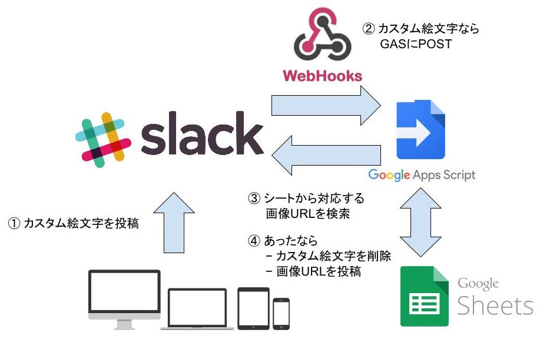
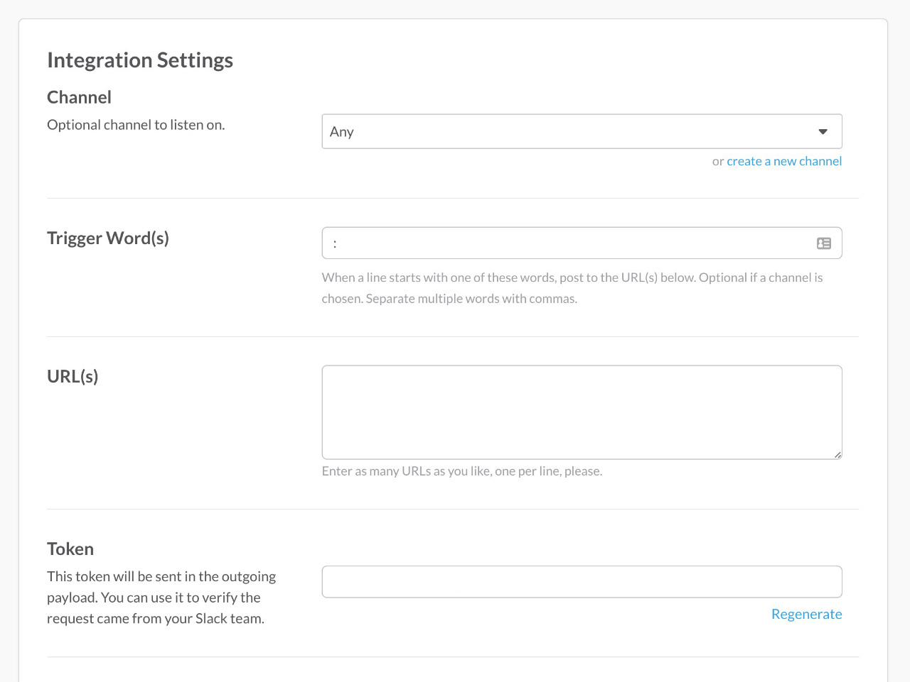
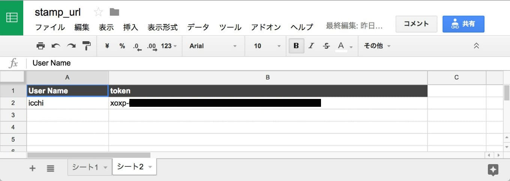
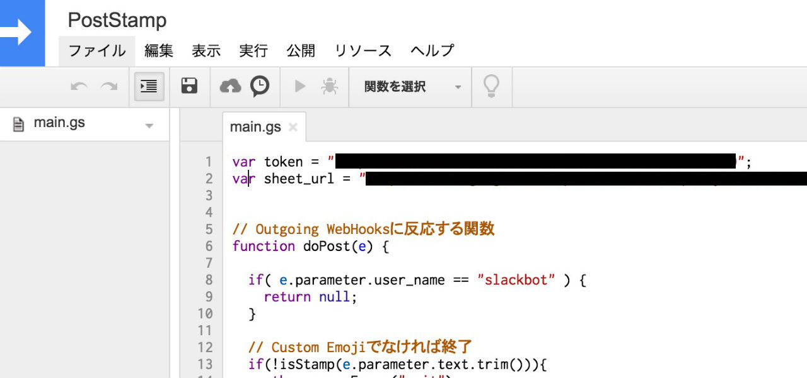
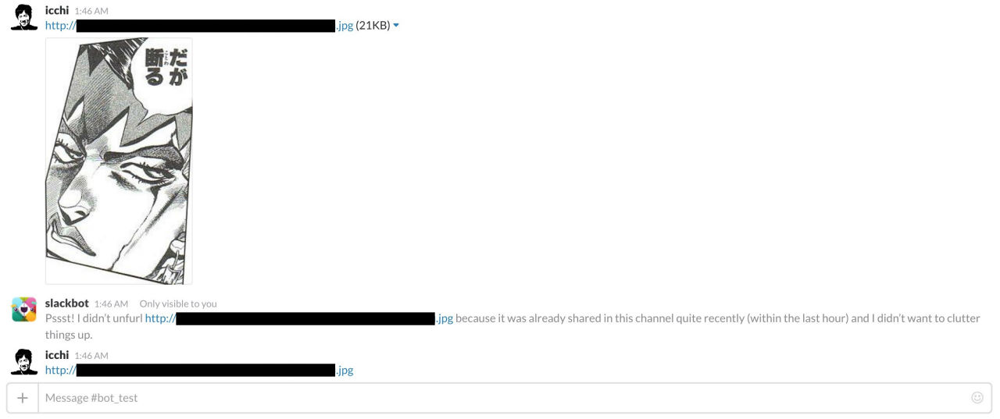
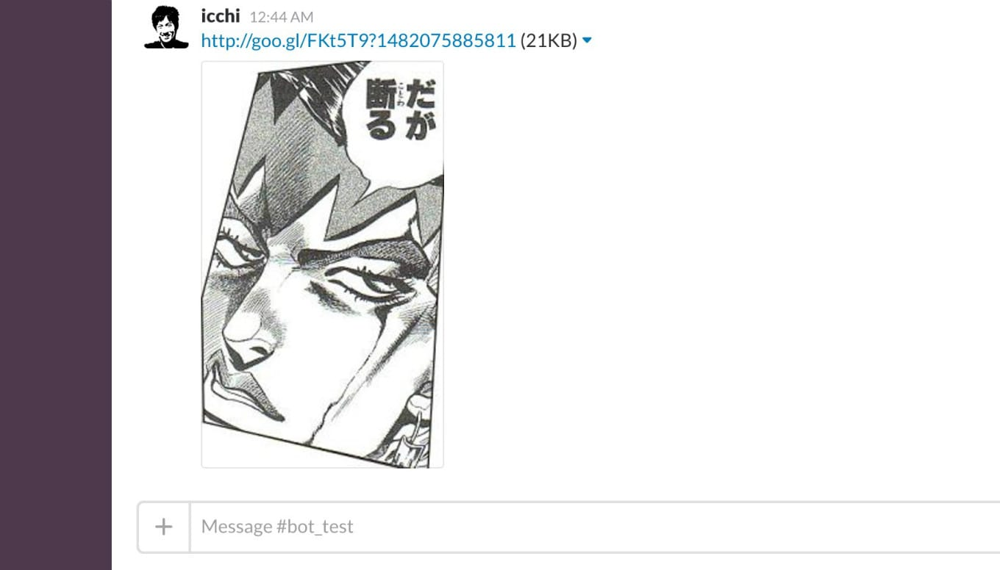

**追記**

こちらの記事内で利用している API Token は旧式(Legacy Token)であり非常に強力な権限を持つものです。現在は新しいタイプの Token の利用が推奨されています。

セキュリティが甘い部分もあり、本記事の内容はあくまで参考として読んでいただけると幸いです。

この記事は[『Slack Advent Calendar 2016』](https://qiita.com/advent-calendar/2016/slack)21 日目の記事です。

この記事は Advent Calendar 用に、以前実装した**Slack 上でスタンプを表示するシステム**を改良したものです。変更点についてはこちら。

## Background

少し前から面白い記事に触発されてプライベートでも Slack を使い始めました。

- [Slack がカップル専用アプリだった件](https://kuma-no-kara-age.hatenablog.com/entry/2016/01/10/212347)
- [割と本気で家庭用 Slack を作ってみた](https://blog.8arrow.org/entry/2016/01/13/183349)

確かに外部サービスとの連携が便利ですが、1 ヶ月ほど使っているとやはり LINE のようなスタンプが使えればと思ってしまいます。

一応 Slack にも絵文字機能があり自分で作れたりも出来るのですが、何せ小さい。

> [@BenJamski](https://twitter.com/BenJamski) [@technancy](https://twitter.com/technancy) We have jumbomoji already、if you post a message with only emoji。Check they're enabled in your preferences
>
> — Slack (@SlackHQ) [2016 年 8 月 5 日](https://twitter.com/SlackHQ/status/761379811705126914)

公式曰く**Jumbomoji**という機能によって絵文字単体で投稿すると通常よりも大きくなるそうですが...

**ジャンボ**にしては小さい...

例えばこのような元画像が 400px 程度のスタンプ用画像をカスタム絵文字にしようもんなら、ほぼほぼ見えません。

やはり LINE で慣れてしまうともう少し大きいサイズがしっくりきます。皆同じことを思うようで Twitter 上では「もっとサイズを大きく出来ないの?」との質問が多数。

> [@SlackHQ](https://twitter.com/SlackHQ) we have to go bigger。Can it be a setting? Max emoji size? We want full 128px if possible。:) [pic.twitter.com/6q6FIn9iW7](https://t.co/6q6FIn9iW7)
>
> — Alex3 (@Alex3omg) [2016 年 4 月 18 日](https://twitter.com/Alex3omg/status/722104950054989824)

> [@Alex3omg](https://twitter.com/Alex3omg) No plans to go any bigger just yet、but thanks for the feedback!
>
> — Slack (@SlackHQ) [2016 年 4 月 18 日](https://twitter.com/SlackHQ/status/722163156622176256)

それに対して公式の回答は**「絵文字サイズを大きくする予定はない」**

なぜなんだ Slack!

公式がこう言っている以上自分たちで解決するしか無い。

調べてみるといくつか方法があるようでした。こちらの記事ではブラウザ拡張機能を使ったり Slack のデスクトップアプリを拡張して絵文字を拡大表示させています。

- [Slack で LINE みたいにスタンプを使いたいと言われたので](https://qiita.com/kyusyukeigo/items/f4192f6cf210cf6c5e33)

しかし、これらのやり方だと**設定した以外の端末からは大きくなりません**. やはり Slack が使える全ての端末から、PC やスマホ関係なく同じようにスタンプを送信・表示できることが望ましい。

## Slack で LINE みたいにスタンプを表示させるために

Slack では画像のリンクが投稿されると、その画像を展開して表示してくれます。今回はその機能を利用してスタンプを表示できるようにします。

そこで、こんなシステムを考えてみました。

具体的には,&nbsp;Outgoing WegHooks でカスタム絵文字の投稿を検出し、それに対応するスタンプの画像 URL があるならそれを投稿する処理を GAS で実装しました。

GAS を使って外部から処理しているため、**プラットフォームに関係なく Slack が利用できる全ての端末でシステムを利用**することが出来ます。

またカスタム絵文字とそれに対応する画像 URL(直接リンク)の管理は Google スプレッドシートで行います。そのためス**プレッドシートを共有すればチームみんなでスタンプを増やすことが可能。**

### 実際の動作

このシステムを使ってスタンプを表示するとこんな感じになります。

## スタンプシステムの構築方法

これからシステムの作り方を説明します。

### 1. スタンプの準備と画像 URL の取得

まずスタンプとして使いたい画像を用意する。

サイズが大きすぎると Slack の容量を圧迫したりスタンプが大きく表示されすぎてしまうため、240~320px 程度にリサイズすることをオススメします.

無料のオンラインストレージを利用すると手軽に画像の直接リンクを取得できます。Dropbox だとファイルの右クリックから.Google Drive を利用する場合は以下のサイトが参考になります.

- <https://ameblo.jp/wantan-52/entry-12120519832.html>

### 2. Slack 側の準備

Slack 側ではカスタム絵文字の登録と GAS にスタンプの通知を知らせる WebHook の設定を行う.

#### 2.1. カスタム絵文字の登録

カスタム絵文字の登録せずともシステムは動作しますが、スタンプ投稿時に小さいながら確認できるので便利です。

1.1 で用意した画像をカスタム絵文字として登録する場合は手順が本家のサイトに載っています.

<https://get.slack.help/hc/en-us/articles/206870177-Creating-custom-emoji>

絵文字として登録するには画像を 128px 以下にする必要あるので(2016/12/21 時点) 以下のようなサービスを利用して画像を縮小します。

- <https://labo.i-section.net/shukusen-air>
- <https://resizer.myct.jp>

#### 2.2. Outgoing WebHooks の設定

カスタム絵文字を投稿した際のトリガーとなる Outgoing WebHooks とあなたの Slack チームを統合。まだ統合していない方は以下のサイトがわかりやすいです。

[Slack の Outgoing Webhooks を使って投稿](https://qiita.com/chike0905/items/58222a99be460f325ab8)

統合したら以下のように設定。

- Channel: あなたがこのシステムを利用したいチャンネル（基本は Any で OK）
- Trigger Words: `:`
- URL: **3.2 で作成する GAS の公開アドレスを貼り付ける**
- Token: デフォルトで値が入っているがこれは使わない

正確に言うと`:`コロンが含まれている投稿全てに対して POST を投げている。その文字列が絵文字がどうかの判定は GAS 側のプログラムで行ってます。

### 3. GAS 側の準備

Google Drive 上の好きな場所に適当なディレクトリを作成.

#### 3.1. Google スプレッドシートの用意

先ほどのディレクトリ内にスプレッドシートを作成。ファイル名は何でも OK。

シート 1 に対して以下のように入力。

- A 列: 2.1 で登録した Emoji 名
- B 列: カスタム絵文字に対応する 1.2 で取得したスタンプ画像の URL(直接リンク)

次に、シート 2 を作成し以下のように入力.

- A 列: システムを利用するスラックユーザー名
- B 列: ユーザの token

token は slack にログインした状態で以下の URL にアクセスすると生成可能。

https://api.slack.com/web

次にこのスプレッドシートを公開する。公開した URL は GAS のプログラム内で使うためコピーしておく。

#### 3.2. GAS の用意

先ほどのディレクトリ内に GAS ファイルを作成。これもファイル名は何でも OK。

以下のサイトに従って、GAS への Slack ライブラリの導入。

<https://qiita.com/soundTricker/items/43267609a870fc9c7453>

以下のリポジトリのコードを GAS ファイルに貼り付け。

<https://github.com/icchi-h/Stamp_on_Slack/blob/master/main.js>

コード内の token と sheet_url に先ほど取得して値をいれる.&nbsp;こんな感じになっているはず。

最後に、GAS で POST を受け取るためのリンクを取得して、2.2 で設定した Outgoing WebHools の URL にセット。

その流れは以下のサイトで詳しく解説されています。

<https://qiita.com/kyo_nanba/items/83b646357d592eb9a87b#gas%E3%81%A7post%E3%83%AA%E3%82%AF%E3%82%A8%E3%82%B9%E3%83%88%E3%82%92%E5%8F%97%E3%81%91%E5%8F%96%E3%82%8B>

## Let's try

あとは Slack でスタンプを楽しむ!

## システム構築後にスタンプを追加していくには

- 1。(カスタム絵文字の登録と画像の直接リンクの取得)
- 3.1 で作成したスプレッドシートの追記

これの繰り返し。

## 付録. 同じ画像リンクは連続で使えない問題への対処

Slack の仕様上、1 時間以内に同じ画像 URL を連続で投稿しても 1 回目以降は展開して表示されない。

スタンプの使い方を考えるとこれはまずい。

そこで、画像 URL に UnixTime を GET のパラメータとして追記して対処しました。こうすることで一応は異なる URL として認識している。

## 追記. スタンプが BOT ととして投稿される問題を改善 (反映済み)

以前のものでは token を 1 つしか利用していなかったため、**スタンプが BOT として投稿**されていました。そのため本システムによってスタンプが投稿されると、**新規メッセージとして扱われ通知が煩わしい**問題がありました。

そこで、ユーザ毎の token もスプレッドシートで管理・利用することで、ユーザーの投稿になるようにしました。

