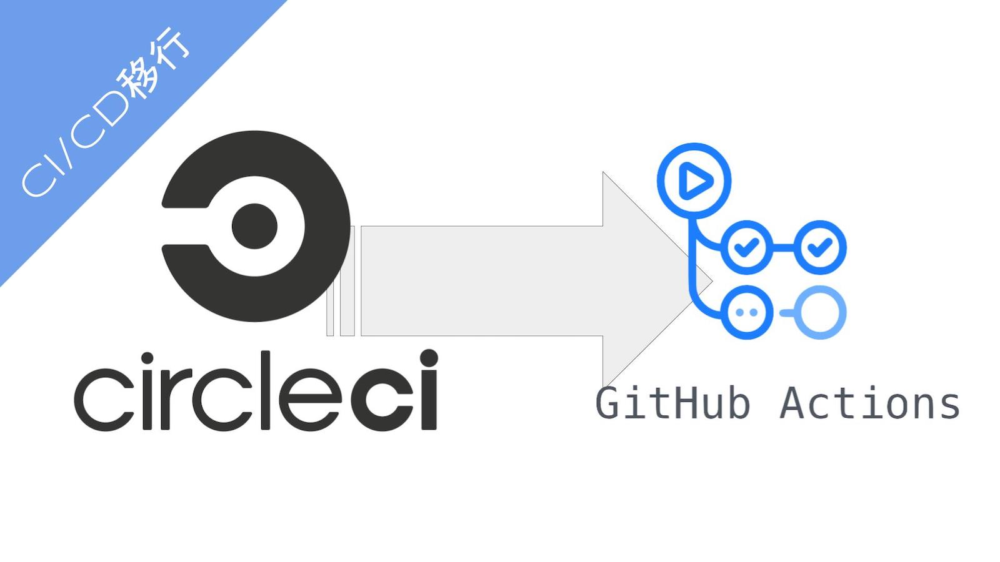
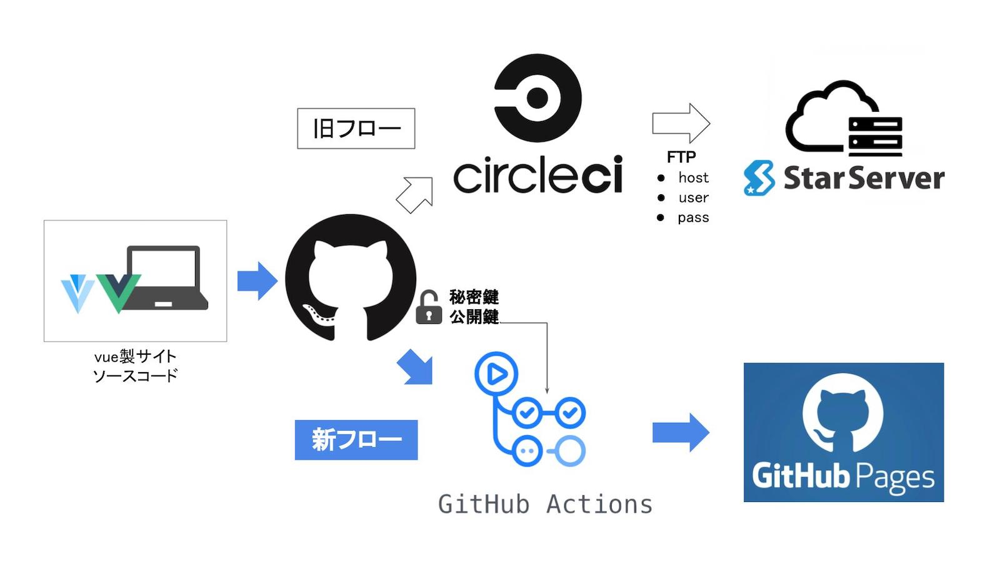
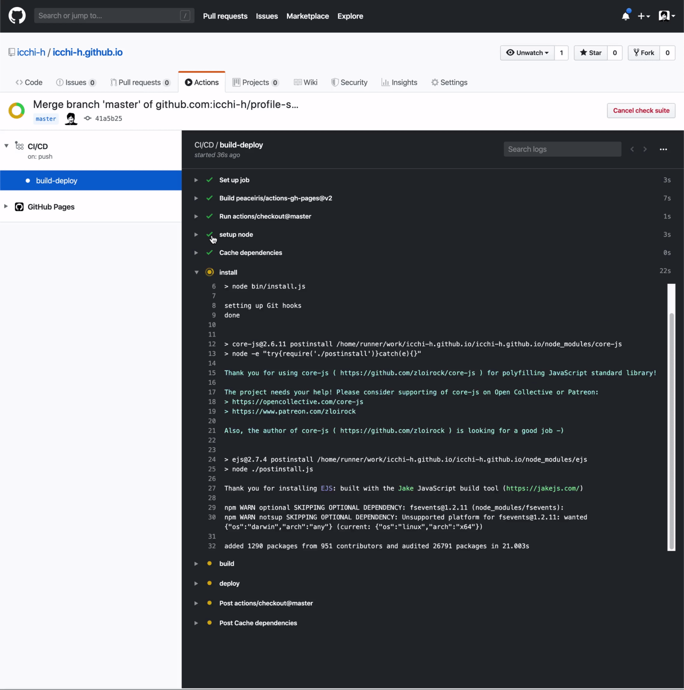

## はじめに

最近仕事でGitHub Actionsを使い始めました。料金体系は従量課金制で、CircleCIを意識してか基本的にGitHub Actionsのほうが安くなるような価格設定です。

プロフィールサイトを改修する機会があったので、ついでにCI/CDをCircleCIからGitHub Actionsに移行してみました。

## モチベーション

* GitHub Actionsを個人プロジェクト(無料枠)でも試してみたかった
* 無料枠での実行時間がCircleCIよりも長い
* コード管理、CI/CD、サイト配信をGitHubで一元化
  * GitHub Actions → GitHub Pages
  * GitHub ActionsとIssue、Pull Requestとの連携

## 移行作業

今回の移行作業を図でまとめるとこんな感じです。



### サイト配信をGitHub Pagesに変更

これまでサイトの配信はドメインの契約時に付随してきたサーバを利用してきました。CircleCIを利用して、Vueで静的サイトを生成(ビルド)した後、FTPでそのサーバに送信する流れです。

今回CI/CDをGitHub Actionsに移行するにあたり、配信もGitHub Pagesを用いることにしました。以下のGitHub Actionsの公開アクションを使って簡単にサイトをGitHub Pagesで公開可能です。

<div class="iframely-embed"><div class="iframely-responsive" style="height: 140px; padding-bottom: 0;"><a href="https://github.com/peaceiris/actions-gh-pages" data-iframely-url="//cdn.iframe.ly/h8rfd8n?iframe=card-small"></a></div></div><script async src="//cdn.iframe.ly/embed.js" charset="utf-8"></script><br/>

また、これまで必要だったFTPの管理からも開放されるのもありがたいところ。一応FTPを扱いたい場合も、[FTP Deploy](https://github.com/marketplace/actions/ftp-deploy)という公開アクションもあるので割と簡単にはできそうです。

#### プロフィールサイトのリポジトリ名を変更

> GitHub Pages サイトには、3 つの種類があります。プロジェクト、ユーザ、そして Organization です。 プロジェクトサイトは、JavaScript ライブラリやレシピ集など、GitHub の特定のプロジェクトに関するものです。 ユーザおよび Organization サイトは、特定の GitHub に関するものです。
>
> <https://help.github.com/ja/github/working-with-github-pages/about-github-pages>

上のように、ユーザタイプのGitHub Pagesを使うためにはリポジトリ名の制約があります。既存のプロフィールサイトリポジトリ名を`profile-site`から`icchi-h.github.io`に変更しました。

必要に応じてローカルのリポジトリ内に含まれるリモートURLも変更。(`<repositoty path>/.git/config`)

#### カスタムドメイン対応

[公式のドキュメント](https://help.github.com/ja/github/working-with-github-pages/managing-a-custom-domain-for-your-github-pages-site#configuring-a-subdomain)にはAレコード指定方式、IP指定方式について記載されています。

今回はCNAME方式を採用しました。`icchi.me`ドメインにアクセスがあった際に`icchi-h.github.io`ドメインを参照するようになります。

あとリポジトリの設定画面から使用するドメイン情報を保存しておきます。Setting → Overview → GitHub Pages。`icchi-h.github.io`へのアクセスは`icchi.me`にリダイレクトしてくれます。


### ソースコードのプッシュブランチを変更

GitHub Pagesの仕様でユーザタイプのページはmasterブランチから配信する必要があります (2020/01/26時点)。プロジェクトタイプは自由に配信用ブランチを選択できるので、同様にしてほしかった。

仕方ないのでサイトのソースコードを`production`、配信を`master`ブランチで管理することにしました。デフォルトブランチは、Code → branches → Change Default Branchから変更可能です。

### CI/CD移行

#### CircleCIの停止

##### WorkFlowの停止

CircleCIコンソール → WORKFLOWS → 今回のWorkFlowの設定 → OverView → Stop Building

##### WorkFlowの設定ファイルを削除

プロフィールサイトのリポジトリ内に含まれているCircleCI用ディレクトリ`.circleci`を削除します。

#### GitHub Action用Deploy Keyを作成

<https://github.com/peaceiris/actions-gh-pages#1-add-ssh-deploy-key>

#### GitHub Actionsの設定ファイルを追加

リポジトリのルートに`.github/workflows/main.yml`を作成しました。

```yaml:title=.github/workflows/main.yml
name: CI/CD

on:
  push:
    branches:
      - production

jobs:
  build-deploy:
    runs-on: ubuntu-18.04
    steps:
      - uses: actions/checkout@master

      - name: setup node
        uses: actions/setup-node@v1
        with:
          node-version: "12.x"

      - name: Cache dependencies
        uses: actions/cache@v1
        with:
          path: ~/.npm
          key: ${{ runner.os }}-node-${{ hashFiles('**/package-lock.json') }}
          restore-keys: |
            ${{ runner.os }}-node-
            ${{ runner.os }}-build-${{ env.cache-name }}-
            ${{ runner.os }}-build-
            ${{ runner.os }}-

      - name: install
        run: npm install

      - name: build
        run: npm run build

      - name: deploy
        uses: peaceiris/actions-gh-pages@v2
        env:
          ACTIONS_DEPLOY_KEY: ${{ secrets.ACTIONS_DEPLOY_KEY }}
          PUBLISH_BRANCH: master
          PUBLISH_DIR: ./dist
```

### README.md内のバッジ更新

`README.md`内に記載されているCI/CDのステータスバッジをCitcleCIからGitHub Actionsのものに変更しました。

```
<!-- CircleCI -->
[](https://circleci.com/gh/icchi-h/profile-site)
↓
<!-- GitHub Actions -->
[](https://github.com/icchi-h/icchi-h.github.io/actions)
```

## デモ

GitHubリポジトリのActionタブから設定したアクションの状態が確認できます。



## 感想

### 簡単

* 既存のリポジトリに`.github/workflows/XXX.yml`を作るだけでCI/CD環境を構築
* [日本語の公式ドキュメント](https://help.github.com/ja/actions/automating-your-workflow-with-github-actions)も充実
* 今回の移行規模であれば1,2時間で完了

### 便利

* コード管理、CI/CD、サイト配信すべてをGitHubで完結
  * 各サービス用のアカウント、決済、システム連携、などの複数管理から開放
  * CI/CDの状態がissueやPull Request上に表示
    * ブラウザのタブ間を行き来不要
    * Lintを設定していればPR上のコードにインラインで結果を表示
      * 機能はCircleCIにはなかったような...?
* 公開されているアクションを利用可能

### 安い

* 無料枠においても1ヶ月あたりの実行時間がCircleCIよりも長くなった
* 有料でも従量課金制+単位時間あたりの金額がCircleCIよりも安い

## おわりに

すでにGitHubをコード管理やサイト公開使っている開発者にはおすすめできるサービスだと感じました。CircleCIやTravisなどにとっては頭が痛いそうだ。

## Reference

1. [GitHub Actions](https://github.co.jp/features/actions)
2. [Github Actionsが使えるようになったので使ってみる](https://qiita.com/1915keke/items/8b18097d2981e88eca93)
3. [GitHub Actions の Private リポジトリの料金概算](https://qiita.com/euxn23/items/8cec3a3b8de9e3213424)
4. [GitHub Actions による GitHub Pages への自動デプロイ](https://qiita.com/peaceiris/items/d401f2e5724fdcb0759d)
5. [GitHub Pages について](https://help.github.com/ja/github/working-with-github-pages/about-github-pages)
6. [依存関係をキャッシュしてワークフローのスピードを上げる](https://help.github.com/ja/actions/automating-your-workflow-with-github-actions/caching-dependencies-to-speed-up-workflows)
7. [カスタムドメインとGitHub Pagesについて](https://help.github.com/ja/github/working-with-github-pages/about-custom-domains-and-github-pages)
8. [GitHub Pages サイトのカスタムドメインを管理する](https://help.github.com/ja/github/working-with-github-pages/managing-a-custom-domain-for-your-github-pages-site#configuring-a-subdomain)
9. [ワークフローのステータスバッジをリポジトリに追加する](https://help.github.com/ja/actions/automating-your-workflow-with-github-actions/configuring-a-workflow#adding-a-workflow-status-badge-to-your-repository)
